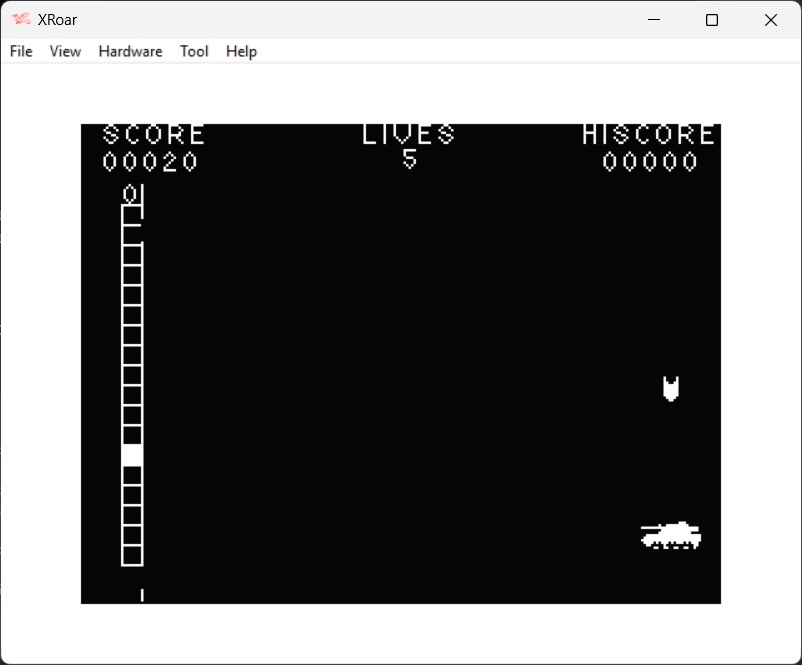
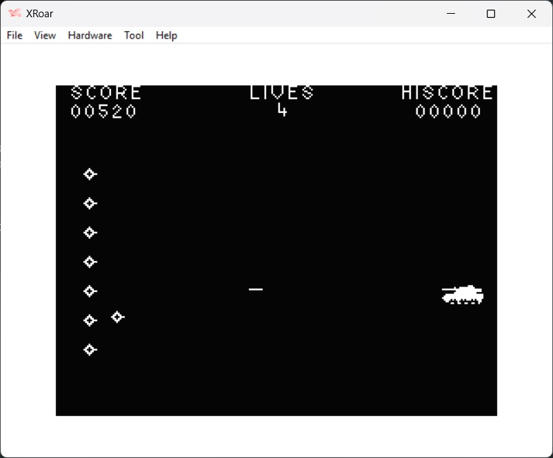

This is a 6809 assembly language one player arcade game for the Dragon 32.  The game is split into two parts:  shoot through the moving gap to hit the boxes while avoiding a bomb (by using hyperspace), and then shoot the moving aliens.
Use the following keys:
| Key | Action |
| --- | --- |
| Q | Move tank UP |
| A | Move tank down |
| CLEAR | Fire |
| ENTER | Hyperspace |

The program was written by Rick Ludkiewicz and originally published in the October 1984 edition of Your Computer Magazine.
Two errors in the original listing have been corrected:
13124\13125 ($3344\$3345) - replaced with 108E0762 (LDY   #$0762).  All instructions after this point have beem moved two bytes in memory.
107178\10719 ($29DE\$29DF) - this parameter (initial position of bomb) is never set and is missing from the code listing.  So it has been set with FCB $08,$BD.  Otherwise there is a chance that the bomb will never hit the tank.
Also, the original keyboard mapping has been changed to make it easier to play on standard keyboard.

| File | Description |
| --- | --- |
| build.bat |  A windows batch file to assemble and run the program file.  1.  Set the path to asm6809 and XROAR (change as required)    2.  Assemble the code file using asm6809   3.  Run the resulting Tanks.bin file in XROAR |
| Tanks.asm | The assembly code file |
| Tanks.cas | The assembled game file. |

Please note, asm6809 and XROAR(and associated ROMS) are not included, but can be downloaded from the following locations: 
https://www.6809.org.uk/xroar/   https://www.6809.org.uk/asm6809/

To run the game without assembling the code file:
+ Download Tanks.cas to your device
+ Open a browser and paste the following URL:  https://www.6809.org.uk/xroar/online/
+ Under the emulation screen, click the File tab
+ Click the load button, and select the downloaded Tanks.cas
+ In the emulation screen, type the following: CLOADM:EXEC   <press enter>
                

